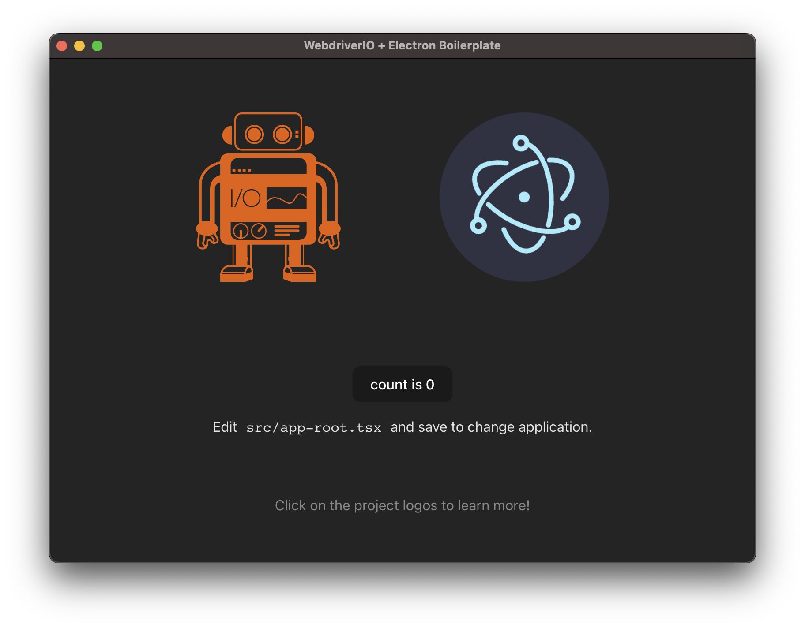

  

# Electron Boilerplate 

Boilerplate project to demonstrate testing ElectronJS Applications with WebdriverIO.

## Quick Start

Choose one of the following options:

1. Download the latest stable release [here](https://github.com/webdriverio/electron-boilerplate/archive/main.zip) or clone the git repo — `git clone https://github.com/webdriverio/electron-boilerplate.git`

2. Then copy the test files (all files in `/test`) to your project directory

3. Merge project dev dependencies with your projects dev dependencies in your `package.json`

## Features

- Super simple setup
- ESNext ready
- Showcases single and multiremote testing, e.g. testing a chat application in ElectronJS and Chrome
- Example using [GitHub Actions](https://github.com/features/actions)
